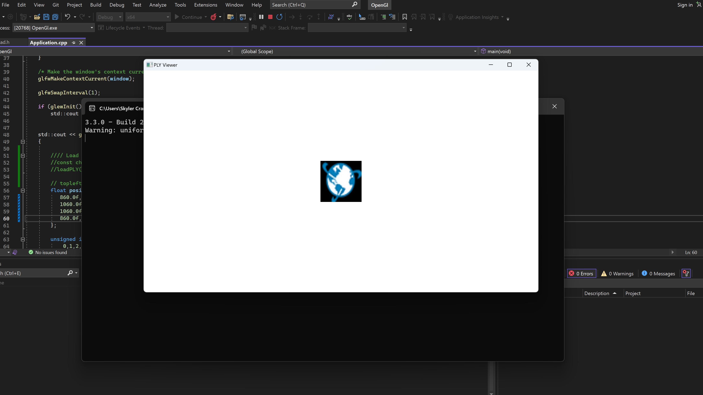

# Graphics Engine from Scratch

## Overview

The primary focus of the project is on implementing a projection matrix to facilitate accurate rendering. This project was created to foster familiarity and proficiency in writing and implementing the graphics pipeline. It covers aspects ranging from vertex and fragment shaders to graphics card programming and establishing communication with the CPU.

## Features

- OpenGL render engine
- Projection matrix implementation
- Use Image as Texture
- Project 2D Shapes
- Support for .ply and .obj 3D formats (Work in progress)
- Lighting (Work in progress)
- File to buffer conversion (Work in progress)

## Application Screenshot

## Current Status

The projection matrix has been successfully implemented. Work is ongoing for the following features:

- Lighting
- Conversion from file to buffer

Feel free to contribute or provide feedback on the project.

## License

This project is licensed under the [MIT License](LICENSE).
